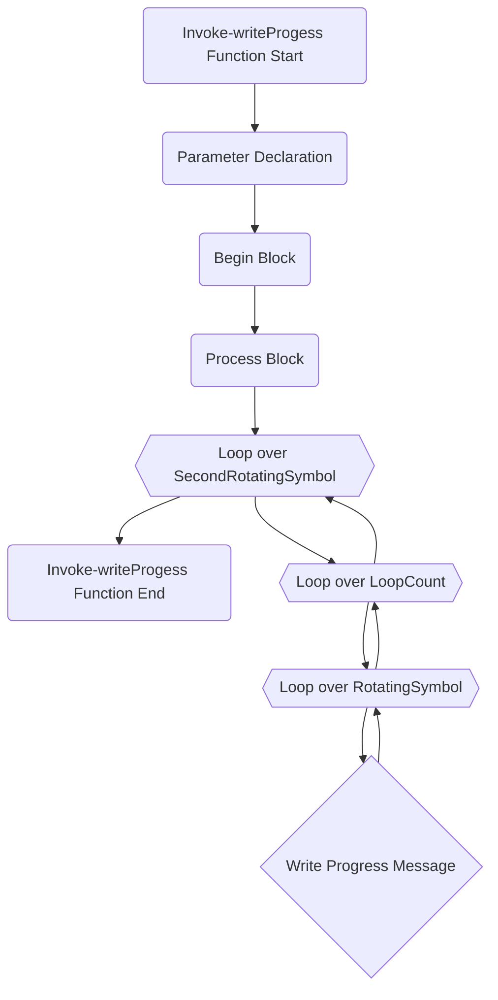

# Invoke-writeProgess PowerShell Function

The `Invoke-writeProgess` function is a PowerShell script that displays a rotating progress message on the console. The rotation is achieved by cycling through two arrays of symbols.

## Parameters

* `Message` - The message to display next to the rotating symbol.
* `RotatingSymbol` - The first array of symbols to cycle through for the rotation. If no array is provided, the default symbols are '|', '/', '-', and '\'.
* `SecondRotatingSymbol` - The second array of symbols to cycle through for the rotation after the first array.
* `LoopCount` - The number of times to cycle through the rotating symbols. If no value is provided, the default is 1.

## Example Usage

```powershell
Invoke-writeProgess -Message "Processing..." -RotatingSymbol @('🌑', '🌒', '🌓', '🌔', '🌕', '🌖', '🌗', '🌘') -SecondRotatingSymbol @('❤️', '🧡', '💛', '💚') -LoopCount 2
```


