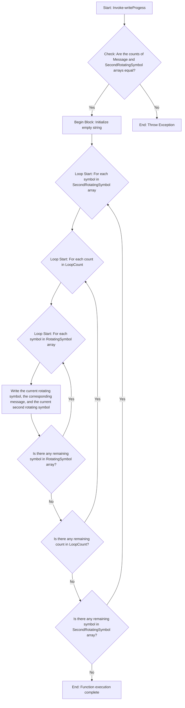

# Invoke-writeProgess

`Invoke-writeProgess` is a PowerShell function designed to display a rotating progress message on the console. The rotation is achieved by cycling through two arrays of symbols. This function is capable of handling multiple stages of processing messages, which change with each rotation of the second symbol.

## Parameters

- **Message** (string array): An array of messages to display next to the rotating symbol.
- **RotatingSymbol** (string array): The first array of symbols to cycle through for the rotation. If no array is provided, the default symbols are '|', '/', '-', and '\'.
- **SecondRotatingSymbol** (string array): The second array of symbols to cycle through for the rotation after the first array.
- **LoopCount** (integer): The number of times to cycle through the rotating symbols. If no value is provided, the default is 1.

## Usage

```powershell
Invoke-writeProgess -Message @('Processing Stage 1...', 'Processing Stage 2...', 'Processing Stage 3...') -RotatingSymbol @('🌑', '🌒', '🌓', '🌔') -SecondRotatingSymbol @('❤️', '🧡', '💛') -LoopCount 2
```




